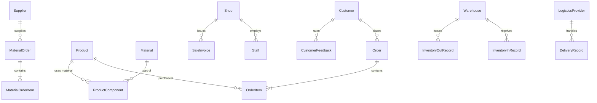
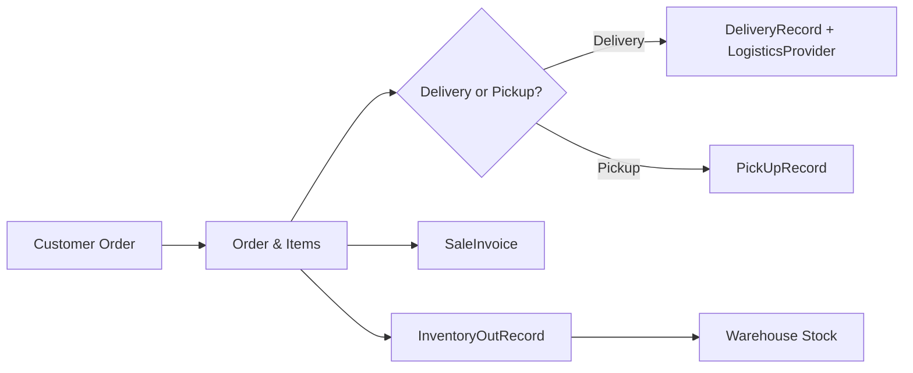

<!-- PROJECT TITLE & BADGES -->
<h1 align="center">🍹 Beverage Retail Database</h1>
<p align="center">
  <i>End‑to‑end relational database for a beverage chain covering orders, inventory, logistics, promotions, and feedback, with SQL reports and BI (regression + ARIMA).</i><br/>
  <a href="https://img.shields.io/badge/DB-PostgreSQL-blue"></a>
  <a href="https://img.shields.io/badge/Language-SQL-orange"></a>
  <a href="https://img.shields.io/badge/Analytics-Python-green"></a>
  <a href="https://img.shields.io/badge/License-MIT-black"></a>
</p>

<p align="center">
  <a href="#-architecture--erd">Architecture & ERD</a> •
  <a href="#-features">Features</a> •
  <a href="#-sql-gallery">SQL Gallery</a> •
  <a href="#-dashboards">Dashboards</a> •
  <a href="#-bi--forecasting">BI & Forecasting</a> •
  <a href="#-repo-structure">Repo Structure</a> •
  <a href="#-quickstart">Quickstart</a>
</p>

---

## 🧭 TL;DR (One‑liner)
> **Identify bottlenecks, optimize stores & channels, and forecast sales** with a production‑style relational schema + analytics layer for a beverage chain.  【60†UG‑DDI Database Design Report】

---

## 🏗 Architecture & ERD
**Core modules:** Orders • Customers • Logistics • Inventory • Promotions • Feedback • Invoicing • Staff

### ERD (simplified)
> Full ERD in `/viz/erd_full.png`. Below is a *readable* slice.



### Data Flow (Order‑to‑Cash)


> Design notes: composite PKs for junctions, check constraints for domains, and indices on FKs and hot filters. 【60†UG‑DDI Database Design Report】

---

## ✨ Features
- 📦 **Inventory & BOM** — Product ↔ Material bill‑of‑materials; auto stock in/out.
- 🚚 **Logistics tracking** — Expected vs. actual delivery, timeout flags & SLA.
- 💡 **Promotions & Discounts** — Event windows, discounted prices per product.
- 🧾 **Invoicing** — Purchase & sale invoices tied to shops and orders.
- ⭐ **Feedback loop** — Product / shop / logistics ratings to close the quality loop.
- 📈 **Analytics** — SQL reports, visual dashboards, regression & ARIMA forecasts.

---

## 🧪 SQL Gallery
<details>
<summary><b>1) Customer order history</b> — items & totals by Customer_ID</summary>

```sql
-- inputs: :customer_id
SELECT o.order_id, o.ototalprice, oi.oinumber, p.pname, oi.oiprice
FROM "Order" o
JOIN OrderItem oi USING (order_id)
JOIN Product p USING (product_id)
WHERE o.customer_id = :customer_id
ORDER BY o.oDate DESC, oi.oiNumber;
```
</details>

<details>
<summary><b>2) Current discounted price</b> — price as of NOW() for a product</summary>

```sql
SELECT p.product_id, p.pname,
       COALESCE(di.dpdiscountedprice, p.pprice) AS effective_price
FROM Product p
LEFT JOIN DiscountedItem di USING (product_id)
LEFT JOIN DiscountEvent de USING (de_id)
WHERE p.product_id = :product_id
  AND (de.destarttime <= NOW() AND de.deendtime >= NOW());
```
</details>

<details>
<summary><b>3) Top‑5 popular products</b> — recommender style</summary>

```sql
SELECT p.product_id, p.pname, COUNT(*) AS times_ordered
FROM OrderItem oi
JOIN Product p USING (product_id)
GROUP BY p.product_id, p.pname
ORDER BY times_ordered DESC
LIMIT 5;
```
</details>

<details>
<summary><b>4) Co‑purchase</b> — frequently bought with :product_id</summary>

```sql
WITH baskets AS (
  SELECT order_id, ARRAY_AGG(product_id) AS items
  FROM OrderItem GROUP BY order_id
)
SELECT p.product_id, p.pname, COUNT(*) AS together
FROM baskets b, UNNEST(b.items) AS pid
JOIN Product p ON p.product_id = pid
WHERE :product_id = ANY(b.items) AND pid <> :product_id
GROUP BY p.product_id, p.pname
ORDER BY together DESC
LIMIT 3;
```
</details>

<details>
<summary><b>5) Staff KPIs</b> — orders handled</summary>

```sql
SELECT staff_id, COUNT(DISTINCT order_id) AS orders, SUM(oi.oiprice) AS revenue
FROM OrderItem oi
GROUP BY staff_id
ORDER BY revenue DESC;
```
</details>

<details>
<summary><b>6) Logistics timeout rate</b></summary>

```sql
SELECT lp_id,
       AVG(CASE WHEN drtimeout = 'Y' THEN 1 ELSE 0 END)::numeric(5,2) AS timeout_rate
FROM DeliveryRecord
GROUP BY lp_id
ORDER BY timeout_rate DESC;
```
</details>

---

## 📊 Dashboards
> Exported PNGs live in `/viz/` (placeholders below for your screenshots).  
- **Product strategy**: `viz/product_strategy/*.png`  
- **Store monitoring**: `viz/store_monitoring/*.png`  
- **Channel monitoring**: `viz/channel_monitoring/*.png`  

<p align="center">
  
  
</p>
<p align="center">
  
  
</p>

---

## 📚 BI & Forecasting
- **Regression (5 models):** Temp, Ad, Discount, Rating + dummies (Location / Channel / Type) and interactions → key lifts: **+7% (Location)**, **+26% (Online)**, **+20% (Pre‑made)** with **positive interactions**.  
- **ARIMA:** one‑year history → rising trend; short dips plausible; aligns with regression insights.  
> Decision playbook: *right‑size stores*, *expand online*, *double‑down pre‑made*. 【60†UG‑DDI Database Design Report】

---

## 📁 Repo Structure
```
beverage-db/
├─ schema/               # SQL DDL (tables, constraints, indexes)
│  ├─ create_tables.sql
│  └─ sample_seed.sql
├─ queries/              # Runnable SQL examples
├─ viz/                  # Exported chart images (PNG)
├─ notebooks/            # regression.ipynb, forecasting.ipynb
└─ README.md
```

---

## ⚡ Quickstart
```bash
# Postgres example
psql -U <user> -d <db> -f schema/create_tables.sql
psql -U <user> -d <db> -f schema/sample_seed.sql

# Run analytics
psql -U <user> -d <db> -f queries/top_popular.sql
```

> Tips: add indexes on FKs; enforce domains via CHECK; role‑based grants for HQ vs stores vs logistics.

---

## 🧩 Tech Stack
**DB:** PostgreSQL/MySQL • **Language:** SQL • **Analytics:** Python (statsmodels) • **Modeling:** ERD • **Viz:** PNG exports

## 👥 Contributors
Renyu Jiang · Yuxiao Deng · Ziyu Liu · Zhengyi Lin · **Lanshun Yuan** (BI analysis lead)  【60†UG‑DDI Database Design Report】

## 📜 License
MIT
